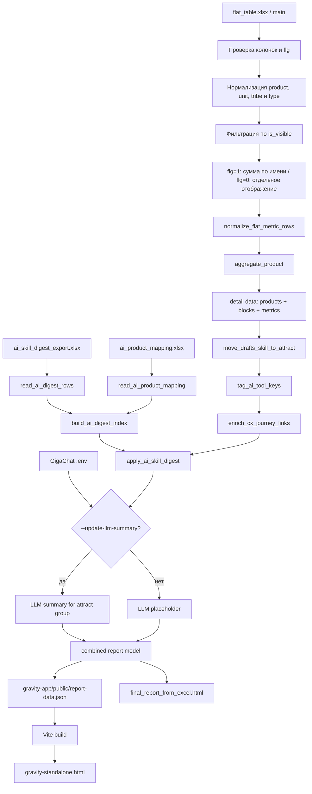

# Data-Driven Index

Локальный генератор рейтинга и детальных карточек Data-Driven Index. Канонический
источник данных — одна книга `flat_table.xlsx`, лист `main`.

Основные артефакты:

- `gravity-app/public/report-data.json` — данные для Gravity UI;
- `gravity-standalone.html` — переносимая версия Gravity UI без сервера;
- `final_report_from_excel.html` — совместимый standalone-отчет.

Отчет открывается как обычный HTML-файл. Данные встраиваются внутрь страницы в JSON-блок, отдельный backend для просмотра не нужен.

## Быстрый Запуск

Полная локальная сборка Gravity UI из единого `flat_table.xlsx`, включая JSON, Vite bundle и standalone HTML:

```bash
python build_gravity_report.py
```

Команда использует flat-table-пайплайн из `build_calc_report.py`, локальные
`ai_skill_digest_export.xlsx` и `ai_product_mapping.xlsx` и не выполняет сетевые
запросы к AI-digest API или GigaChat. Результаты записываются в
`gravity-app/public/report-data.json` и `gravity-standalone.html`.

Локальный сервер для разработки:

```bash
cd gravity-app
npm install
npm run dev
```

После запуска интерфейс доступен на `http://127.0.0.1:5173`.

## Разработка в Herdr

[Herdr](https://herdr.dev/) используется как постоянное терминальное рабочее
пространство для проекта и AI-агентов. Запускайте его из обычного PowerShell в
корне репозитория:

```powershell
cd F:\DD
herdr
```

Внутри Herdr запустите `codex` в терминальной панели. Установленная интеграция
Codex позволяет Herdr показывать состояние агента (`working`, `blocked`, `done`
или `idle`) в боковой панели.

- разделить панель можно через контекстное меню;
- `Ctrl+B`, затем `Q` отключает клиент, не останавливая процессы;
- повторный запуск `herdr` из обычного PowerShell подключает существующую сессию;
- `herdr status` проверяет состояние клиента и сервера;
- `herdr server stop` полностью останавливает сессию.

Не запускайте `herdr` из панели Herdr: вложенные сессии блокируются.

Основная сборка из текущей книги:

```bash
python build_calc_report.py \
  --input "flat_table.xlsx" \
  --output "final_report_from_excel.html"
```

Без запроса к AI-digest API, только из локальных файлов:

```bash
python build_calc_report.py \
  --input "flat_table.xlsx" \
  --output "final_report_from_excel.html" \
  --no-update-ai-digest \
  --no-update-llm-summary
```

Обновление данных Gravity UI из тех же DD, mapping и digest источников:

```bash
python build_calc_report.py \
  --input "flat_table.xlsx" \
  --output "final_report_from_excel.html" \
  --json-output "gravity-app/public/report-data.json" \
  --no-update-ai-digest \
  --no-update-llm-summary
```

Только титульная витрина из отдельного плоского списка:

```bash
python build_title_from_excel.py \
  --input "Расчет_список.xlsx" \
  --sheet "Лист1" \
  --output "final_title_from_excel.html"
```

## Архитектура



## Основной Сборщик

`build_calc_report.py` самодостаточный: внутри файла встроены фрагменты логики титульника, деталки и HTML-рендера. Во время запуска он не импортирует локальные модули проекта и не читает внешний HTML-шаблон.

По умолчанию:

- вход: `flat_table.xlsx`, лист `main`;
- старый титульный лист, если используется legacy-режим: `титул`;
- старый детальный лист, если используется legacy-режим: `деталка`;
- период: `II кв. 2026`;
- выход: `final_report_from_excel.html`;
- локальный AI-digest: `ai_skill_digest_export.xlsx`;
- локальный маппинг продуктов: `ai_product_mapping.xlsx`.

CLI-параметры:

```bash
python build_calc_report.py --help
```

Частые флаги:

- `--no-update-ai-digest` - не ходить в API, читать локальный `ai_skill_digest_export.xlsx`;
- `--skip-ai-digest` - собрать отчет вообще без AI-digest;
- `--no-ai-skills` - не читать AI Excel и маппинг, не вызывать LLM и не показывать AI-навыки в отчете;
- `--ai-digest-token` - переопределить токен AI-digest из `.env`;
- `--ai-digest-timeout` - переопределить таймаут AI-digest в секундах;
- `--refresh-ai-product-map` - пересоздать шаблон `ai_product_mapping.xlsx`;
- `--update-llm-summary` - вызвать GigaChat и сформировать LLM-суммаризацию;
- `--no-update-llm-summary` - не вызывать GigaChat;
- `--llm-log` - печатать вход/выход LLM и причины skip;
- `--no-llm-log` - выключить подробный лог.

## Источники Данных

### Основной flat_table-формат

`flat_table.xlsx` является единым источником титульного рейтинга и детальных
метрик. Поля `is_visible` и `flg` управляют отображением и расчетом:

- `is_visible = 0` — строка полностью исключается из отчета;
- `is_visible = 1`, `flg = 1` — строки с одинаковым названием метрики
  суммируются и участвуют в расчете;
- `is_visible = 1`, `flg = 0` — строка остается отдельной в детализации,
  не объединяется с одноименными строками и исключается из числителя и знаменателя.

Для метрики `Регулярность` числовое значение `факт` трактуется как доля от `1`,
даже если `макс балл` не заполнен. Текстовое значение `не релевантно` остается
неприменимым.

`СХ` нормализуется в `CX`. Каналы сохраняют исходные юниты `DP`/`PC` и не
объединяются в искусственный юнит `Каналы`.

Явная колонка `type` или `тип` является источником типа сущности. В отчет
попадают только строки со значениями `продукт`, `Сегмент` или `Канал`;
остальные типы отбрасываются. Для старых книг без этой колонки сохраняется
временное определение типа по `Column4`.

Обязательные колонки листа `main`:

- идентификация: `metric_code`, `metric_name`, `Юнит`, `трайб`, `product`;
- расчет: `факт`, `макс балл`, `flg`, `is_visible`;
- отображение: `metric_group`, `metric_footer`, `recommendation`, `recommendation_group`.

Для расчетных строк одинаковое пользовательское название определяет агрегацию,
даже если строки имеют разные `metric_code`. Строки `flg = 0` всегда остаются
отдельными.

### Совместимость: upload-формат

Этот путь сохранен для старых входных книг, но не является основным способом
сборки рейтинга.

Если в книге нет пары листов `титул` и `деталка`, включается upload-пайплайн. Он сканирует листы книги и собирает данные из распознанных upload-таблиц.

Поддерживаемые листы:

- `Продукты на заливку` - берутся только строки с типом `продукт`;
- `Сегменты на заливку` - берутся только строки с типом `сегмент`;
- одиночный `Лист1` без листа продуктов - трактуется как продуктовый upload-лист.

В широком upload-листе строка заголовков ищется автоматически по колонкам `Юнит`, `Продукт`, `Оценка`, `value`, `max_value`. Над строкой `value/max_value` должно быть 9 строк описания метрик:

- `metric`;
- `metric_name`;
- `metric_group`;
- `metric_type`;
- `metric_subgroup`;
- `metric_footer`;
- `recommendation`;
- `recommendation_group`;
- `sort`.

Дальше строки продуктов разворачиваются в плоскую структуру метрик.

Также поддерживается уже плоский формат, как на листе `Сегменты на заливку`: каждая строка уже содержит продукт/сегмент, метрику, `value`, `max_value`, группу, футер, рекомендацию и сортировку.

### Совместимость: legacy-формат

Этот путь сохранен для воспроизводимости старых отчетов. Новые расчеты следует
собирать из `flat_table.xlsx`.

Если в книге есть листы `титул` и `деталка`, upload-пайплайн не используется. Генератор читает:

- `титул` - готовые строки витрины;
- `деталка` - плоские строки метрик.

Это поведение важно: смешивать legacy-листы и upload-листы в одной книге сейчас не нужно.

### AI-digest

AI-digest приходит из `GET /api/skill-digest/export` или читается из локального `ai_skill_digest_export.xlsx`.

Ожидаемые колонки:

- `навык`;
- `ключ навыка`;
- `месяц`;
- `продукт`;
- `показатель`;
- `тип`;
- `цвет`;
- `текст`;
- `правило светофора`.

Допустимые значения `тип`:

- `светофор`;
- `текст`.

Если `тип` пустой, но есть `цвет = green/yellow/red`, строка все равно считается светофорной.

Светофор навыка берется по худшему цвету строк выбранного периода. Все строки выбранного периода попадают в раскрывающийся дайджест навыка.

### Маппинг AI-продуктов

Файл `ai_product_mapping.xlsx` связывает название сущности в DD-отчете с названием продукта в AI-digest.

Колонки:

- `dd_product` - название продукта/сегмента в отчете;
- `ai_tool_key` - ключ навыка;
- `ai_tool_product name` - название продукта в AI-digest.

Правила:

- матчинг идет по `dd_product + ai_tool_key + ai_tool_product name`;
- сравнение идет через trim + lower/casefold;
- если `ai_tool_product name` пустой, строка маппинга игнорируется;
- у одного `dd_product + ai_tool_key` может быть несколько строк с разными `ai_tool_product name`;
- в таком случае в HTML строится несколько продуктовых облаков.

Ключи навыков нормализуются. Например, `draft`, `drafts`, `черновик`, `черновики` приводятся к `drafts`.

## Логика Расчета

### Титульник

Титульник получает строки из upload/legacy-источника и показывает:

- юнит;
- трайб, если есть;
- название сущности;
- тип: `продукт`, `Сегмент`, `канал`, `дзо` и т.п.;
- Data-Driven Index;
- группу зрелости;
- delta и общий балл, если есть в источнике.

Если титульные строки отсутствуют, они генерируются из детальных продуктов.

### Детальная Карточка

Деталка строится по продукту/сегменту:

- строки группируются по `metric_group`;
- метрики внутри группы агрегируются по названию;
- `BENCHMARKS` делится пополам в `Воронка привлечения` и `Воронка оттока`;
- `metric_subgroup` и `sort` используются для серых смысловых облаков и порядка метрик внутри блока;
- ссылки из специальных metric rows превращаются в кнопки и footer-ссылки;
- `Знание об отчетности в Навигаторе` опускается вниз блока самооценки;
- навык `Черновики` переносится в `Группа навыков «Привлечение»`.

### Data-Driven Index

Индекс считается как:

```text
round(sum(value) / sum(max_value) * 100)
```

В расчет не входят:

- неприменимые метрики;
- метрики с `max_value <= 0`;
- `*.auto_regularity`;
- `hyp.ab_tests`;
- информационные upload-метрики `Цифр.факторы`, `Цифр.цели`, `Цифр.прогнозы`.

Для `Регулярность (авто)` в привлечении и оттоке `max_value` может восстанавливаться из `value`, чтобы светофор отражался корректно, но сама метрика остается информационной и не влияет на индекс.

### Светофоры Метрик

Для обычных метрик:

- green: `value == max_value`;
- yellow: `0 < value < max_value`;
- red: `value == 0`;
- gray: неприменимо или `max_value <= 0`.

Для AI-digest:

- цвет берется из поля `цвет`;
- если у навыка несколько строк, общий цвет навыка - худший из цветов;
- строки `тип = светофор` отображаются первыми;
- строки с `Показатель = Рекомендации` отображаются в конце облака.

## Рендер AI-digest В HTML

Раскрывашка навыка строится только из строк Excel AI-digest. Синтетические строки `Текст` не создаются.

Формат каждого облака:

```text
[капсула продукта]
[светофор] [Показатель жирным]
[Текст обычным шрифтом]
Правило: [правило светофора]
```

Если по одному DD-продукту сматчено несколько AI-продуктов, каждый AI-продукт получает отдельное облако.

Для загрузки AI-digest из API можно указать настройки в `.env` рядом со скриптом:

```env
AI_SKILL_DIGEST_TOKEN=
AI_SKILL_DIGEST_TIMEOUT=600
```

`AI_SKILL_DIGEST_TIMEOUT` задается в секундах. Значение по умолчанию - `600`, то есть 10 минут.

## LLM-суммаризация

LLM-суммаризация добавляется в `Группа навыков «Привлечение»`.

В LLM передаются название текущего DD-продукта и только AI-digest строки, которые уже сматчились через `ai_product_mapping.xlsx`. DD-метрики, индекс и несматченные продукты в prompt не отправляются.

Для запуска нужны переменные окружения в `.env` рядом со скриптом:

```env
GIGACHAT_TOKEN=
GIGACHAT_AUTH_URL=
GIGACHAT_SCOPE=GIGACHAT_API_CORP
GIGACHAT_MODEL=GigaChat-2-Max
GIGACHAT_WORKERS=5
GIGACHAT_TIMEOUT=300
```

Запуск:

```bash
python build_calc_report.py \
  --no-update-ai-digest \
  --update-llm-summary \
  --llm-log
```

Полная сборка JSON, Gravity UI и итогового standalone HTML одной командой:

```bash
./build_with_llm.sh
```

Если LLM не запрошена или не настроена, в группе навыков показывается placeholder `LLM-cуммаризация`.

## Выходная Модель

Итоговый HTML содержит JSON в блоке:

```html
<script id="dd-data2" type="application/json">
```

Основные части модели:

- `title.rows` - строки титульника;
- `title.units` - список юнитов;
- `title.types` - типы сущностей;
- `products[]` - детальные карточки;
- `products[].metrics[]` - блоки;
- `block.metrics[]` - метрики блока;
- `block.tools[]` - AI-навыки, инструкции, группы навыков;
- `ai_skill_digest` - техническая сводка по AI-digest, matching и LLM.

## Ограничения

- `build_calc_report.py` самодостаточный, но из-за этого файл большой: часть логики зашита строками.
- Если в книге есть листы `титул` и `деталка`, upload-пайплайн не включается.
- Названия колонок Excel должны совпадать с ожидаемыми или нормализуемыми алиасами.
- `ai_product_mapping.xlsx` должен лежать локально и не хранится в git.
- При `--no-update-ai-digest` API не вызывается, но локальные `ai_skill_digest_export.xlsx` и `ai_product_mapping.xlsx` все равно перечитываются каждый запуск.
- AI-digest матчится только через связку `dd_product + ai_tool_key + ai_tool_product name`.
- Если нет маппинга, навык не обогащается AI-digest.
- Если последняя дата AI-digest равна текущему месяцу, показывается предыдущий закрытый месяц.
- Если данные старше 3 месяцев, показывается предупреждение об устаревших данных.
- Токен AI-digest берется из `AI_SKILL_DIGEST_TOKEN` или из флага `--ai-digest-token`.
- LLM-суммаризация зависит от доступности GigaChat и корректной `.env`.
- `final_report_from_excel.html` является generated artifact: ручные правки в HTML будут потеряны при следующей сборке.

## Отдельный Титульник

`build_title_from_excel.py` генерирует только титульную витрину.

Обязательные колонки:

- `Юнит`;
- `Продукт`;
- `Оценка`;
- `Группа`;
- `type` или `тип`.

Запуск:

```bash
python build_title_from_excel.py \
  --input "Расчет_список.xlsx" \
  --sheet "Лист1" \
  --output "final_title_from_excel.html"
```

На выходе получается standalone HTML с фильтрами по юниту и типу, сортировкой по юнитам или Data-Driven Index и неактивной кнопкой `Перейти`.
