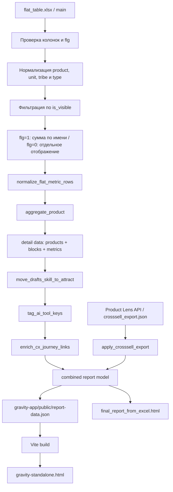

# Data-Driven Index

Локальный генератор рейтинга и детальных карточек Data-Driven Index. Канонический
источник данных — одна книга `flat_table.xlsx`, лист `main`.

Основные артефакты:

- `gravity-app/public/report-data.json` — данные для Gravity UI;
- `gravity-standalone.html` — переносимая версия Gravity UI без сервера;
- `Кликстрим_Месячный_все_воронки_zeroed_gravity.html` — соседний Gravity UI-отчёт по кликстрим-воронкам;
- `final_report_from_excel.html` — совместимый standalone-отчет.

Отчет открывается как обычный HTML-файл. Данные встраиваются внутрь страницы в JSON-блок, отдельный backend для просмотра не нужен.

## Быстрый Запуск

Полная локальная сборка Gravity UI из единого `flat_table.xlsx`, включая JSON, Vite bundle и standalone HTML:

```bash
./build_gravity_report.sh
```

Скрипт использует корневой `.env`, а при его отсутствии также проверяет
`$HOME/Documents/Codex/DD-dev/.env`. Другой env-файл можно передать через
`DD_ENV_FILE=/path/to/.env`. Все аргументы передаются в Python-сборщик, например
для offline-сборки: `./build_gravity_report.sh --no-update-crosssell`. Env-файл
читается как dotenv: строки без формата `KEY=VALUE` безопасно пропускаются.
Python запускается напрямую, без `uv`: значение `PYTHON` имеет приоритет, иначе
wrapper использует `python3`. Один и тот же выбранный интерпретатор используется для
сборки и загрузки.

После успешной сборки скрипт автоматически загружает `gravity-standalone.html`
в Qlik QRS. Укажите `HTML_UPLOAD_CERT_PASSWORD`; wrapper использует
автообнаружение сертификата и CA bundle из `upload_html.py` и проверяет стандартные
каталоги сертификатов. Пути можно явно переопределить через `HTML_UPLOAD_CERT_PATH` и
`HTML_UPLOAD_CA_BUNDLE`: только тогда wrapper передаёт `--cert-path` и `--ca-bundle`.
Тестовый endpoint задаётся через `HTML_UPLOAD_URL`, а браузерный User-Agent — через
`HTML_UPLOAD_USER_AGENT`; `HTML_UPLOAD_BOOTSTRAP_URL` позволяет переопределить
страницу, через которую сертификат создаёт сессию. Загрузчик сначала открывает эту
страницу в одной `requests.Session`, проверяет, что сервер установил cookie сессии, и
затем отправляет файл той же сессией; cookie не передаются и не сохраняются вручную.
Обычный запуск загружает отчёт только в test extension `45678_3_test_`. Флаг
`--upd-prod` после test дополнительно загружает тот же отчёт в `45678_2`; production
endpoint можно переопределить через `HTML_UPLOAD_PROD_URL`. Прямой legacy-вызов
`upload_html.py` поддерживает `--cert-password`. Флаг `--no-upload` отключает автоматическую загрузку,
`--upload` сохранён как явный совместимый режим, а `--data-only` всегда
пропускает загрузку.

Команда использует flat-table-пайплайн из `build_calc_report.py`.
Сборка не требует внешних digest-файлов и не вызывает генеративные модели. Связи
навыков между карточкой команды и специализированными листами берутся из статического
`ai_skill_product_mapping.json`; файл входит в репозиторий и не требует API дайджеста.
Cross-sell с Product Lens по умолчанию включён. Результаты записываются в
`gravity-app/public/report-data.json` и `gravity-standalone.html`. Чтобы
включить «Декомпозицию бэклога» в сайдбаре и standalone-отчёте, запустите
сборку с явным флагом:

```bash
./build_gravity_report.sh --with-backlog
```

При этом используется `sbertrack_all_full_history_to_export.xlsx` и обновляется
`gravity-app/public/backlog-data.json`.

Локальный сервер для разработки:

```bash
cd gravity-app
npm install
npm run dev
```

После запуска интерфейс доступен на `http://127.0.0.1:5173`.

### Соседние HTML-инструменты

Дополнительные HTML-отчёты задаются в корневом env как JSON-объект
`id -> {url, title, icon}`. `title` определяет подпись в сайдбаре, а `icon` —
имя иконки Gravity UI из поддерживаемого списка. Пример находится в
`.env.example`:

```dotenv
VITE_HTML_PAGE_URLS={"clickstream":{"url":"./Кликстрим_Месячный_все_воронки_zeroed_gravity.html","title":"Анализ кликстрим воронок","icon":"ChartLine"},"client_metrics":{"url":"","title":"Клиентские метрики","icon":"ChartColumn"},"complaints":{"url":"","title":"Жалобы и обращения","icon":"Comments"},"csi":{"url":"","title":"CSI","icon":"CircleCheck"},"drafts":{"url":"","title":"Черновики","icon":"FileText"},"funnel":{"url":"","title":"Воронка кампейнинга","icon":"ChartAreaStacked"}}
```

Поддерживаемые значения `icon`: `ChartLine`, `ChartColumn`,
`ChartAreaStacked`, `Sparkles`, `Comments`, `CircleCheck`, `FileText`.
Неизвестное значение безопасно заменяется на `ChartLine`. Старый формат
`"id":"./report.html"` тоже поддерживается.

При публикации переносите указанные companion HTML-файлы в одну папку с
`gravity-standalone.html`. Их содержимое не встраивается в основной standalone.
Для гарантированной установки фильтров и автоматического запуска расчёта
основной отчёт и companion HTML должны открываться с одного HTTP-origin.

Gravity UI-версия кликстрим-отчёта пересобирается из исходного `zeroed.html`
командой:

```bash
cd gravity-app
npm run build:clickstream
```

## Разработка в Herdr

[Herdr](https://herdr.dev/) используется как постоянное терминальное рабочее
пространство для проекта и AI-агентов. Запускайте его из обычного PowerShell в
корне репозитория:

```powershell
cd F:\DD
herdr
```

Внутри Herdr запустите `codex` в терминальной панели. Установленная интеграция
Codex позволяет Herdr показывать состояние агента (`working`, `blocked`, `done`
или `idle`) в боковой панели.

- разделить панель можно через контекстное меню;
- `Ctrl+B`, затем `Q` отключает клиент, не останавливая процессы;
- повторный запуск `herdr` из обычного PowerShell подключает существующую сессию;
- `herdr status` проверяет состояние клиента и сервера;
- `herdr server stop` полностью останавливает сессию.

Не запускайте `herdr` из панели Herdr: вложенные сессии блокируются.

Основная сборка из текущей книги:

```bash
python build_calc_report.py \
  --input "flat_table.xlsx" \
  --output "final_report_from_excel.html"
```

Обновление данных Gravity UI из того же DD-источника:

```bash
python build_calc_report.py \
  --input "flat_table.xlsx" \
  --output "final_report_from_excel.html" \
  --json-output "gravity-app/public/report-data.json"
```

Помесячная декомпозиция бэклога строится из отдельной выгрузки тикетов.
Колонка `team` обязательна; каждая команда агрегируется независимо и доступна
в фильтре дашборда.

```bash
python build_backlog_data.py \
  --input "sbertrack_all_full_history_to_export.xlsx" \
  --output ".context/backlog-data-candidate.json"
```

По умолчанию в расчёт входит история с 1 февраля по 30 июня 2026 года
включительно; более ранние и более поздние тикеты, отменённые тикеты и строки
без `Issue key` исключаются. Границы истории можно изменить параметрами
`--history-start` и `--history-end`. `team.meta.historyEnd` фиксирует правую
границу, `team.meta.excludedAfterHistoryEnd` — число исключённых более поздних
тикетов, а `asOf`, месяцы и кварталы не выходят за эту дату. Для задач,
созданных до правой границы, более поздние `Resolved` и даты переходов
цензурируются: июльские завершения не меняют показатели завершения, cycle time
и TTM на 30 июня. Структура бэклога строится по месяцу `Created`: каждая задача
учитывается ровно один раз, в месяце создания. В публичный JSON не выгружаются
ключи тикетов, данные сотрудников и исходные даты переходов — только
обезличенные агрегаты и метаданные границ отчёта.

Завершённые задачи без `Resolved` не получают вымышленную дату и считаются
открытыми; их количество публикуется в `team.meta.terminalWithoutResolved` как
сигнал качества данных. До исправления источника операционные показатели
закрытого потока и остатка бэклога такой команды могут быть искажены.

Кандидат можно переносить в `gravity-app/public/backlog-data.json` только после
сверки баланса `totalTickets = includedTickets + excludedCancelled +
excludedMissingIssueKey + excludedBeforeHistoryStart +
excludedAfterHistoryEnd` для каждой команды и проверки
`terminalWithoutResolved`. Ненулевое значение требует исправления дат в
источнике или явного решения владельца данных; генератор даты не подставляет.

Квартальный dashboard использует задачи, созданные в выбранном квартале. Цель
Discovery считается подтверждённой, когда задачи направления `Аналитика`
составляют не менее 40% созданных задач. По той же базе считаются доли рутины
и автоматизации. Все графики сгруппированы по дате `Created`: для каждой
месячной когорты показано, сколько созданных задач находится в завершённых
статусах `Resolved` / `Done` (с учётом локализованных эквивалентов). Квартальный
фильтр задаёт правую границу временных графиков: история до выбранного квартала
сохраняется, более поздние месяцы скрываются.

Медианный cycle time считается в днях между переходом задачи в `in_progress`
и датой перехода в `Done` / `Resolved`. Доля заполнения Story Points считается
по задачам Created-когорты выбранного квартала; при значении ниже 90% первой
показывается рекомендация использовать Story Points при планировании.

Только титульная витрина из отдельного плоского списка:

```bash
python build_title_from_excel.py \
  --input "Расчет_список.xlsx" \
  --sheet "Лист1" \
  --output "final_title_from_excel.html"
```

## Архитектура


```mermaid
flowchart TD
    A["flat_table.xlsx / main"] --> B["Проверка колонок и flg"]
    B --> C["Нормализация product, unit, tribe и type"]
    C --> D["Фильтрация по is_visible"]
    D --> E["flg=1: сумма по имени / flg=0: отдельное отображение"]
    E --> H["normalize_flat_metric_rows"]
    H --> I["aggregate_product"]
    I --> J["detail data: products + blocks + metrics"]
    J --> K["move_drafts_skill_to_attract"]
    K --> L["tag_ai_tool_keys"]
    L --> M["enrich_cx_journey_links"]

    N["Product Lens API / crosssell_export.json"] --> O["apply_crosssell_export"]
    M --> X["combined report model"]
    O --> X

    X --> Y["gravity-app/public/report-data.json"]
    X --> Z["final_report_from_excel.html"]
    Y --> AA["Vite build"]
    AA --> AB["gravity-standalone.html"]
```

## Основной Сборщик

`build_calc_report.py` самодостаточный: внутри файла встроены фрагменты логики титульника, деталки и HTML-рендера. Во время запуска он не импортирует локальные модули проекта и не читает внешний HTML-шаблон.

По умолчанию:

- вход: `flat_table.xlsx`, лист `main`;
- старый титульный лист, если используется legacy-режим: `титул`;
- старый детальный лист, если используется legacy-режим: `деталка`;
- период: `II кв. 2026`;
- выход: `final_report_from_excel.html`;

CLI-параметры:

```bash
python build_calc_report.py --help
```

Частые флаги:

- `--no-ai-skills` - не показывать AI-навыки и Cross-sell;
- `--crosssell-json` - путь к локальному кэшу ответов Product Lens;
- `--no-update-crosssell` - не обращаться к Product Lens, использовать локальный кэш;

Cross-sell интеграция использует `GET /api/v1/crosssell/markers` как основной
стабильный контракт и `GET /api/v1/crosssell/products` для продуктов каталога,
у которых marker ещё не сформирован. Сопоставление с DD выполняется по имени
после NFC/casefold-нормализации; токен должен иметь scope `crosssell:read`.
Проверка TLS-сертификата для внутреннего Product Lens по умолчанию отключена;
защита доступа выполняется Bearer-токеном. Чтобы принудительно включить проверку
сертификата, задайте `PL_PARTNER_CROSSSELL_INSECURE_TLS=false`.
Снимки рыночного исследования загружаются из `GET /api/v1/crosssell/market`,
а предложения и источники исследованных продуктов — из
`GET /api/v1/crosssell/market/{uid}`. ETag списка и каждого продукта хранится
отдельно, поэтому повторная сборка переиспользует локальный кэш при ответе `304`.
Ссылка «Перейти» открывает витрину `/showcase/crosssell/` сразу на каноническом
`uid` продукта в hash-параметре `product`.
Интеграция включена во всех обычных сборках. Для offline-сборки без обращения к
API передайте `--no-update-crosssell`: отчёт использует локальный кэш
`crosssell_export.json`. Общий флаг `--no-ai-skills` отключает все AI-навыки,
включая Cross-sell.
Количество замеченных связок берётся из `seen_out_n`, `seen_in_n` и
`seen_around_n`, потенциальных — из `potential_n`; legacy-поле `implemented`
сохраняется только для диагностики.

```bash
python build_gravity_report.py
```

## Источники Данных

### Основной flat_table-формат

`flat_table.xlsx` является единым источником титульного рейтинга и детальных
метрик. Поля `is_visible` и `flg` управляют отображением и расчетом:

- `is_visible = 0` — строка полностью исключается из отчета;
- `is_visible = 1`, `flg = 1` — строки с одинаковым названием метрики
  суммируются и участвуют в расчете;
- `is_visible = 1`, `flg = 0` — строка остается отдельной в детализации,
  не объединяется с одноименными строками и исключается из числителя и знаменателя.

Для метрики `Регулярность` числовое значение `факт` трактуется как доля от `1`,
даже если `макс балл` не заполнен. Текстовое значение `не релевантно` остается
неприменимым.

`СХ` нормализуется в `CX`. Каналы сохраняют исходные юниты `DP`/`PC` и не
объединяются в искусственный юнит `Каналы`.

Явная колонка `type` или `тип` является источником типа сущности. В отчет
попадают только строки со значениями `продукт`, `Сегмент` или `Канал`;
остальные типы отбрасываются. Для старых книг без этой колонки сохраняется
временное определение типа по `Column4`.

Обязательные колонки листа `main`:

- идентификация: `metric_code`, `metric_name`, `Юнит`, `трайб`, `product`;
- расчет: `факт`, `макс балл`, `flg`, `is_visible`;
- отображение: `metric_group`, `metric_footer`, `recommendation`, `recommendation_group`.

Для расчетных строк одинаковое пользовательское название определяет агрегацию,
даже если строки имеют разные `metric_code`. Строки `flg = 0` всегда остаются
отдельными.

### Совместимость: upload-формат

Этот путь сохранен для старых входных книг, но не является основным способом
сборки рейтинга.

Если в книге нет пары листов `титул` и `деталка`, включается upload-пайплайн. Он сканирует листы книги и собирает данные из распознанных upload-таблиц.

Поддерживаемые листы:

- `Продукты на заливку` - берутся только строки с типом `продукт`;
- `Сегменты на заливку` - берутся только строки с типом `сегмент`;
- одиночный `Лист1` без листа продуктов - трактуется как продуктовый upload-лист.

В широком upload-листе строка заголовков ищется автоматически по колонкам `Юнит`, `Продукт`, `Оценка`, `value`, `max_value`. Над строкой `value/max_value` должно быть 9 строк описания метрик:

- `metric`;
- `metric_name`;
- `metric_group`;
- `metric_type`;
- `metric_subgroup`;
- `metric_footer`;
- `recommendation`;
- `recommendation_group`;
- `sort`.

Дальше строки продуктов разворачиваются в плоскую структуру метрик.

Также поддерживается уже плоский формат, как на листе `Сегменты на заливку`: каждая строка уже содержит продукт/сегмент, метрику, `value`, `max_value`, группу, футер, рекомендацию и сортировку.

### Совместимость: legacy-формат

Этот путь сохранен для воспроизводимости старых отчетов. Новые расчеты следует
собирать из `flat_table.xlsx`.

Если в книге есть листы `титул` и `деталка`, upload-пайплайн не используется. Генератор читает:

- `титул` - готовые строки витрины;
- `деталка` - плоские строки метрик.

Это поведение важно: смешивать legacy-листы и upload-листы в одной книге сейчас не нужно.

## Логика Расчета

### Титульник

Титульник получает строки из upload/legacy-источника и показывает:

- юнит;
- трайб, если есть;
- название сущности;
- тип: `продукт`, `Сегмент`, `канал`, `дзо` и т.п.;
- Data-Driven Index;
- группу зрелости;
- delta и общий балл, если есть в источнике.

Если титульные строки отсутствуют, они генерируются из детальных продуктов.

### Детальная Карточка

Деталка строится по продукту/сегменту:

- строки группируются по `metric_group`;
- метрики внутри группы агрегируются по названию;
- `BENCHMARKS` делится пополам в `Воронка привлечения` и `Воронка оттока`;
- `metric_subgroup` и `sort` используются для серых смысловых облаков и порядка метрик внутри блока;
- ссылки из специальных metric rows превращаются в кнопки и footer-ссылки;
- `Знание об отчетности в Навигаторе` опускается вниз блока самооценки;
- навык `Черновики` переносится в `Группа навыков «Привлечение»`.

### Data-Driven Index

Индекс считается как:

```text
round(sum(value) / sum(max_value) * 100)
```

В расчет не входят:

- неприменимые метрики;
- метрики с `max_value <= 0`;
- `*.auto_regularity`;
- `hyp.ab_tests`;
- информационные upload-метрики `Цифр.факторы`, `Цифр.цели`, `Цифр.прогнозы`.

Для `Регулярность (авто)` в привлечении и оттоке `max_value` может восстанавливаться из `value`, чтобы светофор отражался корректно, но сама метрика остается информационной и не влияет на индекс.

### Светофоры Метрик

Для обычных метрик:

- green: `value == max_value`;
- yellow: `0 < value < max_value`;
- red: `value == 0`;
- gray: неприменимо или `max_value <= 0`.

## Выходная Модель

Итоговый HTML содержит JSON в блоке:

```html
<script id="dd-data2" type="application/json">
```

Основные части модели:

- `title.rows` - строки титульника;
- `title.units` - список юнитов;
- `title.types` - типы сущностей;
- `products[]` - детальные карточки;
- `products[].metrics[]` - блоки;
- `block.metrics[]` - метрики блока;
- `block.tools[]` - AI-навыки, инструкции, группы навыков;
- `crosssell` - техническая сводка по обогащению Product Lens.

## Ограничения

- `build_calc_report.py` самодостаточный, но из-за этого файл большой: часть логики зашита строками.
- Если в книге есть листы `титул` и `деталка`, upload-пайплайн не включается.
- Названия колонок Excel должны совпадать с ожидаемыми или нормализуемыми алиасами.
- `final_report_from_excel.html` является generated artifact: ручные правки в HTML будут потеряны при следующей сборке.

## Отдельный Титульник

`build_title_from_excel.py` генерирует только титульную витрину.

Обязательные колонки:

- `Юнит`;
- `Продукт`;
- `Оценка`;
- `Группа`;
- `type` или `тип`.

Запуск:

```bash
python build_title_from_excel.py \
  --input "Расчет_список.xlsx" \
  --sheet "Лист1" \
  --output "final_title_from_excel.html"
```

На выходе получается standalone HTML с фильтрами по юниту и типу, сортировкой по юнитам или Data-Driven Index и неактивной кнопкой `Перейти`.
